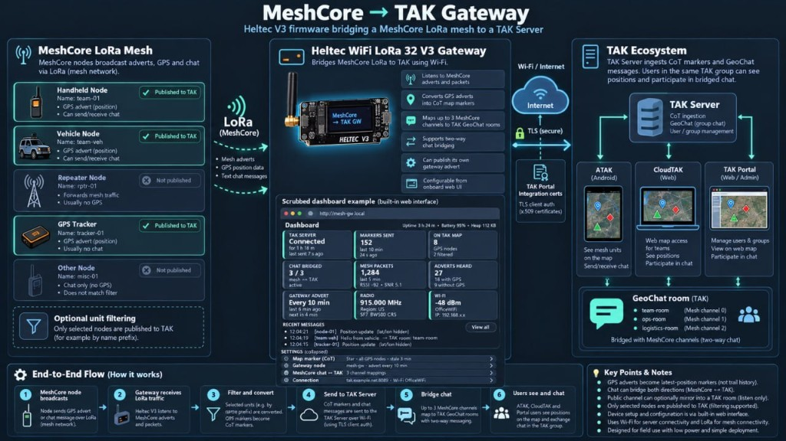
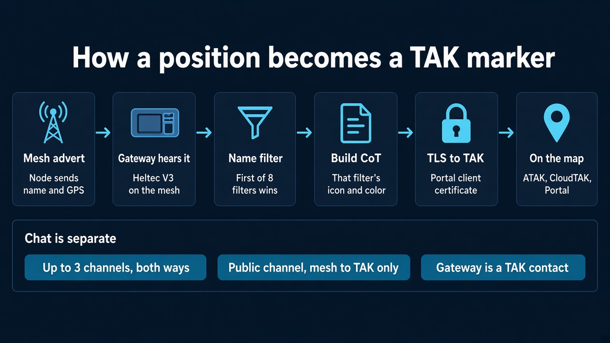
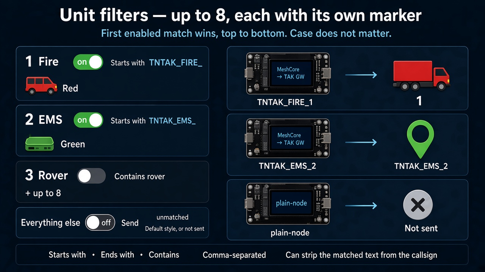

# MeshCore → TAK Gateway

Firmware for a **Heltec WiFi LoRa 32 V3** that listens to a [MeshCore](https://github.com/meshcore-dev/MeshCore) mesh and puts it on a **TAK Server**. Nodes that advertise a GPS position become map markers. MeshCore channel chat is posted to TAK GeoChat rooms. The gateway connects over TLS with the client certificate from a **TAK Portal Integration**, and everything is set up from a web page on the device.

**One-way: MeshCore → TAK.** The gateway sends locations and chat from the mesh to the TAK Server. Nothing from TAK goes back onto the mesh: messages sent in ATAK, CloudTAK, or TAK Portal are not transmitted on MeshCore. An earlier build that also carried TAK chat back to the mesh is described in [docs/two-way-chat.md](examples/tak_gateway/docs/two-way-chat.md).

This repository is a fork of MeshCore. The gateway is [`examples/tak_gateway/`](examples/tak_gateway/). The rest of the tree is upstream MeshCore, described in [README.MeshCore.md](README.MeshCore.md).



The picture above is the system at a glance. The dashboard in it is an example of the page the device serves. Filtering on the device is the eight unit filters described below, not a single name prefix.

## How a position gets on the map



1. A MeshCore node includes its name and location in an advert.
2. The Heltec hears that advert on the mesh radio. Wi-Fi is only the path to the TAK Server.
3. The name is checked against the unit filters, top to bottom. The first enabled filter that matches chooses the marker.
4. The gateway builds one CoT event for that node, using that filter's icon, color, and remarks. The uid stays the same for the life of the node, so TAK updates the marker in place. It does not draw a trail.
5. The event goes to the TAK Server over TLS, using the Portal Integration certificate.
6. Anyone in the matching read group sees it in ATAK, CloudTAK, or TAK Portal.

Only adverts that carry a usable GPS position are considered. Repeaters that only forward traffic, and nodes with no position, are not placed on the map. Stale time, re-send interval, and remove-after time are shared by every marker.

## Unit filters

You can add **up to 8 filters**. Each one has its own match rule and its own CoT style, so different units on the same mesh can show up as different icons and colors.



- **Match.** Each filter is one of **Starts with**, **Ends with**, or **Contains**. The text can list several values separated by commas (`TNTAK_FIRE_, FIRE-`). Matching ignores case.
- **Order.** Filters run from top to bottom. The first enabled filter that matches wins, so a specific rule can sit above a broader one.
- **Style.** Each filter has its own 2525 symbol, TAK Default iconset icon, or spot-map dot, plus color, opacity, remarks, how, and archive. `TNTAK_FIRE_` can be a red vehicle while `TNTAK_EMS_` is green.
- **Callsign.** A filter can strip the matched start or end text from the name TAK shows. A "contains" rule is not stripped.
- **Everything else.** Nodes that match no filter use the default style when **Send unmatched MeshCore units** is on. When that switch is off, they are not sent, and a marker that was already on the map is removed.

The heard-GPS list on the setup page shows which filter each live node would use, so the rules can be checked before saving.

## Chat, advert, and the setup page

- **Chat to TAK.** Messages heard on up to 3 MeshCore channels (a private key, or a `#hashtag` name) are posted to TAK chat rooms, and the MeshCore Public channel can be mirrored into a room too. This is one-way: replies typed in TAK stay in TAK. Each message is placed on the map at the gateway location. The last few messages sent appear on the page and on the OLED.
- **Mesh advert.** The gateway can flood its own MeshCore advert, with a name and a location, on a schedule or on demand, so it appears in contact lists and on mesh maps.
- **Setup page.** Title, identification banner, accent color, and logo. The same title is shown on the OLED. Sections collapse to a one-line summary.
- **Updates.** The version is the UTC time the code was finished (`YY.MMDD.HHMM`, shown with a Z). The page reports when GitHub has a newer release, and the device can install it. Settings, keys, and certificates are kept.

## Hardware

- Heltec WiFi LoRa 32 **V3** (ESP32-S3, SX1262, SSD1306 OLED)
- A 2.4 GHz Wi-Fi network that can reach NTP and the TAK Server

## Build and flash

Install [PlatformIO](https://platformio.org/), then from the repository root:

```bash
pio run -e Heltec_v3_tak_gateway -t upload
```

For a first flash or recovery, build a merged image and write it at `0x0`:

```bash
pio run -e Heltec_v3_tak_gateway -t mergebin
```

Images are written to `.pio/build/Heltec_v3_tak_gateway/`.

If you edit the setup page (`examples/tak_gateway/web/index.html`), regenerate the embedded assets before building (Python with Pillow; icon data is downloaded from CloudTAK on first run):

```bash
python examples/tak_gateway/tools/build_web_assets.py
```

## Versions and updates

The version is the UTC (Zulu) time the code was finished, `YY.MMDD.HHMM`. `26.1002.1349` is 2 Oct 2026, 13:49Z. It is shown on the setup page, the OLED at boot, and the serial log.

- A build from a clean checkout uses the last commit's time, so it matches that commit's GitHub release. A build with uncommitted changes uses the build time.
- A push to `main` that touches the gateway publishes a GitHub release (`.github/workflows/tak-gateway-release.yml`) with `tak_gateway_heltec_v3.bin` (over-the-air), `tak_gateway_heltec_v3_full.bin` (USB flash at `0x0`), and `version.txt`.
- The gateway checks the latest release 10 minutes after boot, then every 6 hours. The TAK link pauses during a check or an install, because the device has no spare memory for a second TLS session. **Install update** downloads it, checks it, and restarts. You can also upload a `.bin` under **System → Firmware**.
- Downloads are checked against the GitHub root certificates in `tak/TakUpdateRoots.h`. If GitHub changes certificate authority, regenerate that file with `python examples/tak_gateway/tools/make_update_roots.py`.

## Setup

1. Power the gateway. With no Wi-Fi saved, it opens an access point **`MeshCore-TAK-Setup`** (password `meshcoretak`). Join it and open <http://192.168.4.1>. Sign in as **`admin`** / **`meshcore`**, then set your own password under **System**.
2. **Connection.** Enter the Wi-Fi network and the TAK Server host and port from the Portal Integration. After Wi-Fi joins, the page is also on the device's LAN address, shown on the OLED.
3. **Portal certificate.** In TAK Portal, create an Integration, give it a `*_WRITE` group, and download the certs. On the setup page, under **Certificate**, select the `.pem` and the `.key` and install. One certificate is all the gateway needs, since it only sends.
   Portal keys are usually encrypted with 3DES (passphrase `atakatak`), which this device cannot decrypt. If the page install fails, install from a PC (it asks for the web password):

   ```bash
   pip install cryptography
   python examples/tak_gateway/tools/install_certs_to_device.py <device-ip> <unzipped-cert-folder>
   ```

4. **MeshCore radio.** Pick the preset that matches the mesh (US is 910.525 MHz, BW 62.5, SF 7, CR 5), or enter custom values. A node on a different bandwidth or spreading factor will not be heard.
5. **Map marker.** Add the unit filters, or leave **Send unmatched MeshCore units** on to publish every GPS node with the default style. Save.
6. Turn on **Send to TAK Server** and save. The status pill turns green when the link is up, and the Portal Integration shows Connected.

Users in the matching `*_READ` group see the markers and the chat. They cannot reply onto the mesh through the gateway.

### Chat channels

Channel keys are typed on the setup page and stored only on the device. The API never returns them. Paste the 32-hex or base64 secret from the MeshCore app's Share Channel screen, or use a `#hashtag` channel, which needs no key. Each channel maps to a TAK room (the channel name, if you leave the room blank). A mesh message `name: text` shows up in the room from `name`. The gateway only listens on these channels; it never transmits chat on the mesh.

### Trackers

Any MeshCore node that puts its location in adverts will appear: a T-Beam, or a companion radio with GPS and advert location sharing on. A short advert interval keeps a moving tracker current.

### Tracker channel

A GPS tracker can also send a short `!MT1` fix on one private channel instead of putting the live position in its advert. The radio sends a stable id, a role such as `fw`, and the fix. The callsign is the MeshCore sender name. This gateway paints the marker. Color, icon, and CoT type are not in the radio message.

Turn **tracker parsing** on for that private channel and use the same channel key as the radio. Parsing stays off until that box is checked, including after a firmware update. One channel can carry a K9, a vehicle, a person, and a fire unit. The role on the radio selects the picture:

| Role | Asset | Color |
|---|---|---|
| `k9` | K9 | `#0010EB` |
| `veh` | Vehicle | `#F59E0B` |
| `per` | Person | `#22C55E` |
| `fw` | Fire | `#EF4444` |
| `ems` | EMS | `#F97316` |
| `cmd` | Command | `#A855F7` |

An unknown role uses that channel's fallback style. A per-id row can change one tracker's callsign or picture without changing the radio.

The MeshCore Android app can set the tracker's name and its channel. It cannot set the role, and nobody types the `!MT1` text. Role, and a callsign you need kept after reboot, are set from the radio's USB console at 115200 baud (`name`, `role`, `channel`, `status`). The radio's Tracker screen shows the role, the channel, and the last fix it sent. Radio setup is written up in [MeshCoreTracker](https://github.com/CopIXus/MeshCoreTracker). The T-Beam firmware in this repository is `Tbeam_SX1276_meshcore_tracker` or `Tbeam_SX1262_meshcore_tracker`.

## Device controls

- **Button.** A click cycles the OLED pages. Holding PRG for 3 seconds opens the setup access point **`MeshCore-TAK-Setup`** for 10 minutes, even while the gateway is on Wi-Fi.
- **Setup access point fallback.** If the gateway cannot join its Wi-Fi network for a minute, it opens the setup access point by itself.
- **Network watchdog.** If Wi-Fi reports connected but the TAK Server has not been reachable for 3 minutes, the gateway rejoins Wi-Fi. If that does not help within another 3 minutes, it restarts.
- **Serial, 115200 baud.** `status` prints the version, link state, memory, and Wi-Fi details. `fs` lists flash files. `ap` opens the setup access point. `factory_reset` clears Wi-Fi, TAK settings, certificates, and the logo.

## Security

- The client certificate, private key, and channel secrets live in the device's flash. They are not compiled into the firmware and they are not in this repository. `.gitignore` excludes `*.key`, `*.p12`, and `examples/tak_gateway/certs_converted/`.
- The setup page and its API require a login (HTTP digest, user `admin`). Change the default password `meshcore` on first setup. The password is never sent back to the browser. If it is lost, run `factory_reset` over serial.
- The page is plain HTTP, so settings travel unencrypted on the LAN. Keep the gateway on a trusted network. The setup access point uses the password above and turns off once the gateway joins Wi-Fi.

## Source layout

| Path | Role |
|------|------|
| `examples/tak_gateway/main.cpp`, `MyMesh.*` | Startup, mesh listener, chat channels, adverts |
| `examples/tak_gateway/tak/` | Settings, node table, filters, CoT builder, TLS client, web server, OLED, updates |
| `examples/tak_gateway/web/index.html` | Setup page (embedded as `TakWebAssets.h`) |
| `images/` | The pictures in this README |
| `examples/tak_gateway/tools/` | Page assets, version stamp, update root CAs, Portal certificate install |
| `examples/tak_gateway/docs/` | Design notes, including the removed TAK → mesh chat |
| `variants/heltec_v3/platformio.ini` | `Heltec_v3_tak_gateway` build environment |

## Credits and license

- [MeshCore](https://github.com/meshcore-dev/MeshCore) by the MeshCore developers, MIT, see [license.txt](license.txt).
- Marker icons from [CloudTAK](https://github.com/dfpc-coe/CloudTAK) and the [CloudTAK-Data](https://github.com/dfpc-coe/CloudTAK-Data) Default iconset.
- The gateway code is released under the same MIT license.
